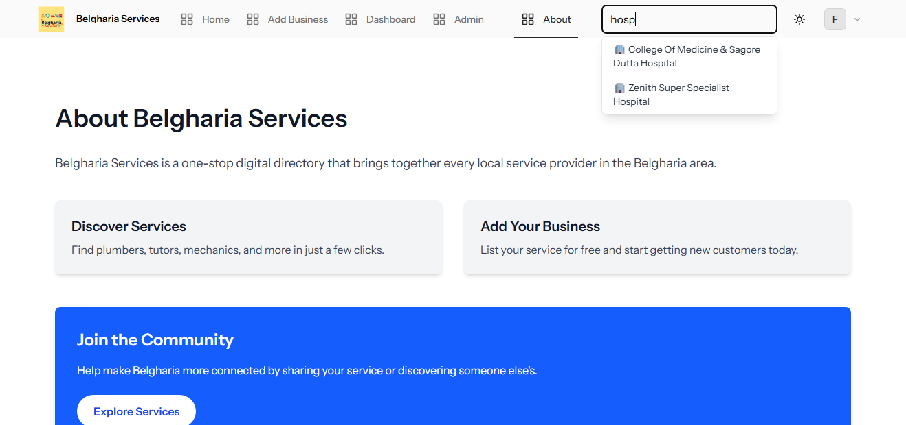

# 🏠 Local Services

> A local service directory connecting residents with trusted providers in their area.

## 🚀 About Local Services

This is a web application designed to help local area residents find and connect with local service providers — from plumbers and electricians to tutors and small businesses.

This platform empowers users to browse services, contact providers directly, and even list their own business for free — all in one place.

### Key Features

-   Browse and search local services
-   Contact providers via phone or email
-   Add, edit, or delete your own listings
-   Admin tools for managing services
-   Fully responsive and accessible UI
-   Light/Dark mode support using Tailwind CSS

## 🛠️ Tech Stack

-   **Framework:** Laravel 12
-   **Frontend:** Tailwind CSS + Alpine.js
-   **Database:** MySQL

## 💻 Built With

This project built primarily for portfolio use. If users find it helpful, there are plans to host it publicly and potentially monetize featured business listings.

## 🌐 Live Demo

You can access the live version of this app at:  
🔗 [belgharia-services.free.nf](https://belgharia-services.free.nf/)

## 📸 Screenshots

| Home Page                            | User Added Services                                       |
| ------------------------------------ | --------------------------------------------------------- |
|  |  |

| Service List                                                               | Admin Dashboard                                                                |
| -------------------------------------------------------------------------- | ------------------------------------------------------------------------------ |
|  |  |

| Search                              | About                             |
| ----------------------------------- | --------------------------------- |
|  |  |

## 📄 License

This project is open source under the **MIT License**.
