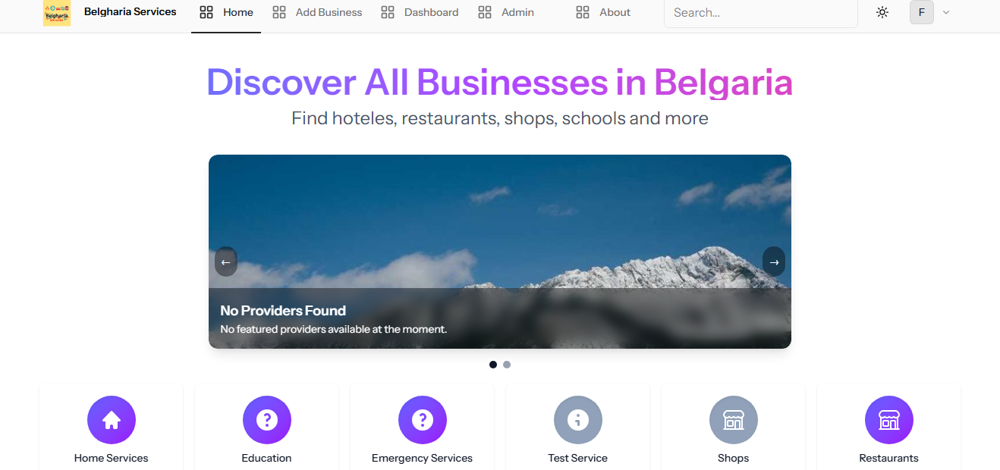
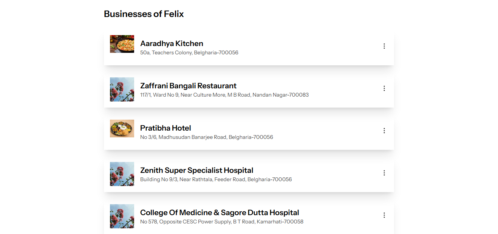

# 🏠 Belgharia Services

> A local service directory connecting residents with trusted providers in Belgharia.

## 🚀 About Belgharia Services

LocalServe Belgharia is a web application designed to help residents of Belgharia find and connect with local service providers — from plumbers and electricians to tutors and small businesses.

This platform empowers users to browse services, contact providers directly, and even list their own business for free — all in one place.

### Key Features

-   Browse and search local services
-   Contact providers via phone or email
-   Add, edit, or delete your own listings
-   Admin tools for managing services
-   Fully responsive and accessible UI
-   Light/Dark mode support using Tailwind CSS

## 🛠️ Tech Stack

-   **Framework:** Laravel 12
-   **Frontend:** Tailwind CSS + Alpine.js
-   **Database:** MySQL
-   **Hosting:** [InfinityFree](https://www.infinityfree.net/)

## 💻 Built With

This is a solo project built primarily for portfolio use. If users find it helpful, there are plans to host it publicly and potentially monetize featured business listings.

## 🌐 Live Demo

You can access the live version of this app at:  
🔗 https://localservebelgharia.infinityfreeapp.com

## 📸 Screenshots

| Home Page                            | Service Listing                                       |
| ------------------------------------ | ----------------------------------------------------- |
|  |  |

| User Profile                                    | Admin Dashboard                                    |
| ----------------------------------------------- | -------------------------------------------------- |
|  |  |

_(You can replace these placeholders with actual screenshots once ready.)_

## 📄 License

This project is open source under the **MIT License**.
